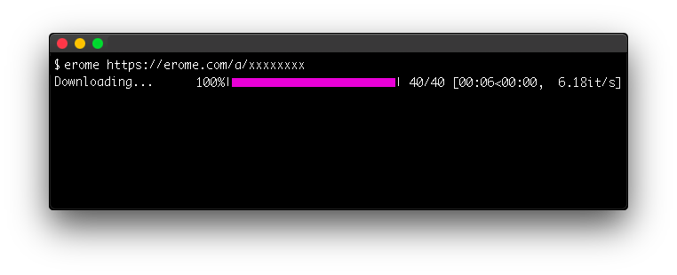

# EroMe Data Scraper

This data scraper requires Python 3.8+

This scraper will download all images and/or videos in an EroMe album. 

# Installation

Download the latest release from the [releases page](https://github.com/Many-Trick/EroMe/releases/new).

In the command line, run the following:

`pip install -r requirements`

macOS users must use pip3:

`pip3 install -r requirements`

Next, open the config.json in the project folder and replace "pathname" with the pathname to a folder where you would like the content to be downloaded:

`{"folder_path": "pathname"}`

For example, it should look similar to this:

`{"folder_path": "/Users/username/Downloads/EroMe"}`

If you're having trouble with installation, please see the [#FAQ](README.md#faq)

*Note: The config.json **must** be in the same folder as the erome.py*

# Usage

In the command line, run the following:

`python erome.py`

macOS users must use python3:

`python3 erome.py`

Once you run the script, you will be prompted for an EroMe album link. Enter the link and then hit 'ENTER.'

# FAQ

*Note: This script was built on macOS, but I'll do my best to help Windows/Linux users.*

**Q: Why do I get an error whenever I run 'pip install -r requirements.txt'?**

A: You either need to change your current working directory (cwd) to the directory/folder that contains the requirements.txt related to this project *or* you can just type in 'pip install -r ' in your command line and drag the requirements.txt file into the command line. If you're on macOS, remember to use pip3 instead.

**Q: Why do I get an error whenever I run 'python erome.py'?**

A: Could be the same case as the first question. Just type 'python ' or 'python3 ' and drag and drop the python script in the command line.

**Q: Why am I getting a message saying that 'config.json' couldn't be found?**

A: Probably because you moved the 'config.json' or the 'erome.py' and they're no longer in the same folder. If you lose your config, just redownload the latest release.
